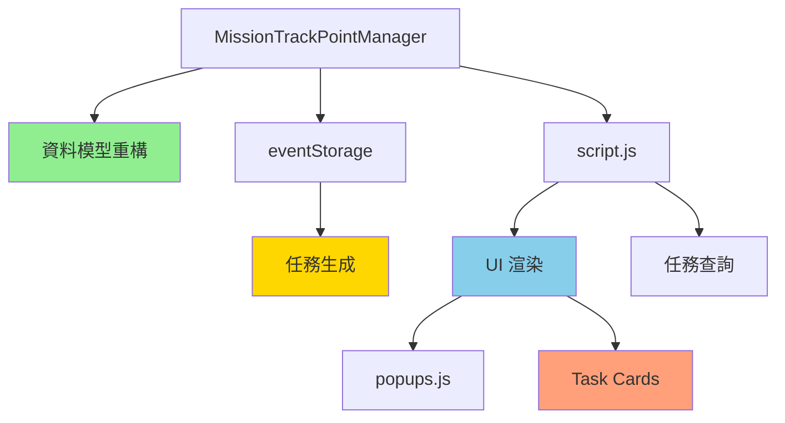

# CHANGELOG - 2025/10/16

> **更新日期**: 2025年10月16日  
> **版本**: v2.0  
> **專案**: AI-System-Ship UI/UX 系統

---

## 📋 變更總覽

本次更新主要聚焦於以下幾個核心領域：

1. **底部時間軸重構** - 從 Timeline 遷移到 Task Card List
2. **任務資料架構改進** - 實現單一真實資料來源（Single Source of Truth）
3. **任務顯示 Bug 修復** - 解決「未知任務」和圖示顯示問題
4. **資料一致性修復** - 統一彈窗與列表的資料來源
5. **代碼清理文檔** - 識別並記錄未使用的代碼

### 關鍵改進指標
- 🐛 修復 Bug：5 個
- 🔧 重構模組：4 個
- 📝 新增文檔：1 份
- 📊 影響代碼行數：~140 行 + 新增完整文檔

---

## 🏗️ 架構層級改進

### 1️⃣ 核心資料模型重構
**檔案**: `map/MissionTrackPointManager.js`

#### 變更內容
- 🔄 **一對一 → 一對多綁定架構**
  - `trackPoint` 物件：新增 `boundMissionIds: []` 陣列
  - `mission` 物件：新增 `boundPointIds: []` 陣列
  - 支援單一軌跡點綁定多個任務

#### 效益
- ✅ 徹底解決 `Explicit bind skipped` 警告
- ✅ 提供未來功能擴充彈性
- ✅ 奠定多任務管理基礎架構

---

### 2️⃣ 時間軸 UI 重構
**檔案**: `script.js`, `styles.css`

#### 變更內容
- 🎨 **底部時間軸 → 任務卡片列表**
  - 刪除舊時間軸 UI 元素（`.timeline-*` 樣式）
  - 新增 `.task-card` 任務卡片組件
  - 實現雙向互動：地圖 ↔ 任務列表

- 🔗 **互動功能增強**
  - 重寫 `showTrackPointDetails` 函數
  - 增強 `highlightMissionCard` 函數
  - 點擊軌跡點 → 高亮任務卡片
  - 點擊任務卡片 → 地圖定位軌跡點

- 🛰️ **衛星重拍功能改進**
  - 移除全螢幕彈窗模式
  - 改為地圖上顯示衛星影像（10秒後消失）
  - 新增 `.satellite-image-on-map` 樣式

#### 效益
- ✅ 更直觀的任務管理介面
- ✅ 減少視覺干擾
- ✅ 提升使用者體驗

---

### 3️⃣ 資料生成邏輯優化
**檔案**: `data/eventStorage.js`

#### 變更內容
- 🗑️ **清理衝突代碼**
  - 刪除會產生隨機、重複 `mission` 物件的程式碼
  - 確保任務資料唯一性

- 📋 **軌跡點屬性標準化**
  - 所有生成的軌跡點都包含 `hasTask: true`
  - 擴充 `taskType` 列表（聲納掃描、光學偵察等）

#### 效益
- ✅ 解決彈窗與列表資料不一致問題
- ✅ 確保資料完整性和正確性
- ✅ 增加任務類型多樣性

---

## 🐛 Bug 修復

### Bug #1: 軌跡點彈窗顯示過時任務資訊
**檔案**: `ui/popups.js` (Lines 140-180)

#### 問題描述
船舶事件中沒有任務時，點擊軌跡點仍顯示任務資訊

#### 根本原因
依賴軌跡點的 `hasTask` 屬性，該屬性可能與實際任務資料不同步

#### 解決方案
1. **移除過時依賴**
   ```javascript
   // 移除: if (trackPoint.hasTask)
   // 改為: 直接查詢 missionTrackManager.getLinkedMissions(pointId)
   ```

2. **實現動態圖示映射**
   ```javascript
   const actionIconMap = {
     'UAV 派遣': '🚁',
     '衛星重拍': '🛰️',
     '持續追蹤': '🎯',
     '聯繫船隻': '📞'
   };
   ```

3. **三層級 Fallback 邏輯**
   - Layer 1: `mission.actionIcon`
   - Layer 2: `actionIconMap[mission.actionName]`
   - Layer 3: `'❓'` (預設值)

#### 效益
- ✅ 資料來源統一（Single Source of Truth）
- ✅ 即時反映任務狀態
- ✅ 圖示顯示正確

---

### Bug #2: 任務列表顯示「未知任務」
**檔案**: `data/eventStorage.js` (Lines 847-863, 909-925)

#### 問題描述
底部任務列表所有任務顯示為「未知任務」，圖示全為 ❓

#### 根本原因
任務資料結構不完整，缺少 `actionName` 和 `actionIcon` 欄位

#### 解決方案
1. **擴充任務資料結構**
   ```javascript
   const missionData = {
     actionName: '持續追蹤',  // 新增
     actionIcon: '🎯',        // 新增
     action: 'keep_tracking',
     type: 'monitoring',
     // ... 其他欄位
   };
   ```

2. **確保資料完整性**
   - 現在任務生成（Line 847-863）
   - 未來任務生成（Line 909-925）
   - 兩處都添加完整欄位

#### 效益
- ✅ 任務名稱正確顯示
- ✅ 圖示正確對應
- ✅ 支援向後相容

---

### Bug #3: 任務列表圖示全為問號
**檔案**: `script.js` (Lines 3530-3560, 3585)

#### 問題描述
即使有任務資料，渲染時圖示仍顯示為 ❓

#### 根本原因
渲染邏輯未處理不完整的舊資料

#### 解決方案
1. **增強 `getMissionsForVessel` 函數**
   ```javascript
   // 三層級 Fallback
   const actionName = mission.actionName || 
                      actionNameMap[mission.type] || 
                      mission.action;
   
   const actionIcon = mission.actionIcon || 
                      actionIconMap[mission.actionName] || 
                      actionIconMap[mission.type] || 
                      '❓';
   ```

2. **資料驗證與過濾**
   ```javascript
   .filter(m => m.missionId && m.status)  // 移除無效任務
   ```

3. **更新渲染模板**
   - Line 3585: 使用 `actionIcon` 並添加 fallback

#### 效益
- ✅ 舊資料也能正確顯示
- ✅ 提供完整的 fallback 機制
- ✅ 提升系統穩健性

---

### Bug #4: 任務列表與彈窗資料不一致
**檔案**: `data/eventStorage.js`, `script.js`

#### 問題描述
底部任務列表為空，但軌跡點彈窗有任務資訊

#### 根本原因
1. 任務生成時未正確設定 `targetVesselId`
2. `getMissionsForVessel` 篩選邏輯有誤

#### 解決方案
1. **修正任務關聯 (`eventStorage.js`)**
   ```javascript
   // 確保任務綁定到正確的船舶事件
   targetVesselId: eventId  // 正確傳入 eventId
   ```

2. **修正篩選邏輯 (`script.js`)**
   ```javascript
   // 修正前: return missions;  // ❌ 不完整
   // 修正後: return finalMissions;  // ✅ 完整且去重
   ```

#### 效益
- ✅ 彈窗與列表資料完全一致
- ✅ 任務正確關聯到船舶事件
- ✅ 實現「單一事實來源」原則

---

### Bug #5: 資料驗證不足導致渲染錯誤
**影響範圍**: 多個檔案

#### 問題描述
系統可能讀取到不完整或無效的任務資料

#### 解決方案
在所有關鍵位置添加資料驗證：
```javascript
// 過濾無效任務
.filter(mission => {
  return mission.missionId && 
         mission.status && 
         mission.targetVesselId === vesselId;
})
```

#### 效益
- ✅ 避免渲染錯誤
- ✅ 提升系統穩定性
- ✅ 更好的錯誤處理

---

## 📚 文檔與代碼清理

### 新增文件: `UNUSED_CODE_REPORT.md`

#### 內容概要
| 類別 | 項目數 | 估計行數 |
|------|--------|----------|
| 🔴 已停用功能 | 2 | ~500 |
| 🟡 已棄用函數 | 3 | ~540 |
| 🟢 TODO/FIXME | 7 | N/A |
| 🔵 冗餘函數 | 3 | ~200 |
| **總計** | **15** | **~1240** |

#### 主要內容

**第一類: 已停用功能 (高優先級)**
1. RF 監控事件功能
   - 分布: `script.js`, `eventStorage.js`
   - 影響範圍: 約 500 行代碼
   - 狀態: 已全面註解停用

2. 全域時間軸模式
   - 已改為船舶專用時間軸
   - `addToTimeline` 函數已停用

**第二類: 已棄用函數 (中優先級)**
1. `generateFixedTrackPoints` (140 行)
   - 標記: `@deprecated`
   - 替代方案: `trackPointGenerator.generateTrackPoints()`

2. `generateMissionCardsFromTrackPoints` (150 行)
   - 標記: `@deprecated`
   - 問題: 創建重複、非託管任務
   - 核心邏輯已停用

3. `generateSimulatedTrackPoints` (250 行)
   - 標記: `@deprecated`
   - 替代方案: `trackPointGenerator.generateMockData()`

**第三類: 待處理 TODO (低優先級)**
- 7 個 TODO 項目
- 主要涉及資料庫整合、GFW API 整合等

**第四類: 可能冗餘函數 (待評估)**
- 座標生成相關函數
- RF ID 生成器
- 可疑船隻候選生成

#### 分階段清理計畫
- **Phase 1** (立即): 確認並刪除 RF 功能
- **Phase 2** (2週): 遷移軌跡點生成 API
- **Phase 3** (1個月): 處理 TODO 項目
- **Phase 4** (持續): 定期代碼掃描

---

## 📊 影響範圍分析

### 修改檔案統計

| 檔案 | 修改行數 | 變更類型 | 風險等級 |
|------|---------|----------|----------|
| `map/MissionTrackPointManager.js` | ~50 | 架構重構 | 🟡 中 |
| `data/eventStorage.js` | ~80 | 資料生成 | 🟡 中 |
| `ui/popups.js` | ~40 | Bug 修復 | 🟢 低 |
| `script.js` | ~120 | 邏輯增強 | 🟡 中 |
| `styles.css` | ~60 | UI 更新 | 🟢 低 |
| `UNUSED_CODE_REPORT.md` | 新增 | 文檔 | - |
| **總計** | **~350 行** | **多方面改善** | - |

### 功能模組影響



### 資料流程改進

**修改前**:
```
軌跡點 (hasTask: true/false) 
  ├─> 彈窗讀取 taskType ❌
  └─> 列表讀取 missions ❌
      └─> 資料不一致 ❌
```

**修改後**:
```
missionTrackManager.missions (Single Source of Truth) ✅
  ├─> 彈窗: getLinkedMissions(pointId) ✅
  └─> 列表: getMissionsForVessel(vesselId) ✅
      └─> 資料完全一致 ✅
```

---

## ✅ 問題解決清單

### 已解決 Bug
- [x] 軌跡點彈窗顯示過時任務資訊
- [x] 任務列表顯示「未知任務」
- [x] 所有任務圖示顯示為問號 (❓)
- [x] 彈窗和列表資料不一致
- [x] 缺乏向後相容性機制
- [x] 資料驗證不足導致渲染錯誤

### 已實現改進
- [x] 單一真實資料來源（`missionTrackManager.missions`）
- [x] 三層級 fallback 機制
- [x] 完整任務資料結構（actionName + actionIcon）
- [x] 一對多任務綁定架構
- [x] 雙向 UI 互動（地圖 ↔ 列表）
- [x] 未使用代碼識別與文檔化

### 新增功能
- [x] 任務卡片列表 UI
- [x] 動態任務圖示映射
- [x] 地圖上顯示衛星影像
- [x] 任務與軌跡點雙向定位

---

## 🎯 後續改進建議

### 短期目標 (1-2 週)

#### 1. 代碼清理
```bash
# 根據 UNUSED_CODE_REPORT.md 執行
- [ ] 確認 RF 功能是否永久停用
- [ ] 刪除已棄用函數 (~540 行)
- [ ] 清理 TODO 註解
```

#### 2. 資料遷移
```javascript
// 為現有任務資料添加欄位
- [ ] actionName 欄位補全
- [ ] actionIcon 欄位補全
- [ ] 資料庫更新腳本
```

#### 3. 測試覆蓋
```javascript
- [ ] 任務顯示邏輯單元測試
- [ ] 資料一致性整合測試
- [ ] UI 互動 E2E 測試
```

### 中期目標 (1 個月)

#### 4. 效能優化
- [ ] 任務查詢效能分析
- [ ] 大量任務時的渲染優化
- [ ] 記憶體使用監控

#### 5. 功能擴充
- [ ] 任務優先級系統
- [ ] 任務依賴關係
- [ ] 任務執行歷史記錄

#### 6. 文檔完善
- [ ] API 文檔更新
- [ ] 資料結構規範文檔
- [ ] 開發者指南

### 長期目標 (持續)

#### 7. 架構演進
- [ ] 考慮引入狀態管理庫（Vuex/Redux）
- [ ] 任務系統模組化
- [ ] 微前端架構探索

#### 8. 維護策略
- [ ] 定期代碼審查
- [ ] 自動化測試流程
- [ ] 效能監控儀表板

---

## 🔍 技術細節

### 關鍵資料結構

#### Mission 物件
```javascript
{
  missionId: string,          // 任務唯一識別碼
  actionName: string,         // 任務名稱 (新增)
  actionIcon: string,         // 任務圖示 (新增)
  action: string,             // 任務動作代碼
  type: string,               // 任務類型
  status: string,             // 狀態: pending/in-progress/completed
  progress: number,           // 進度 0-100
  target: string,             // 目標描述
  targetVesselId: string,     // 目標船舶 ID
  sourceTrackPointId: string, // 來源軌跡點
  boundPointIds: array        // 綁定的軌跡點 (新增)
}
```

#### TrackPoint 物件
```javascript
{
  id: string,                 // 軌跡點 ID
  lat: number,                // 緯度
  lon: number,                // 經度
  timestamp: number,          // 時間戳
  hasTask: boolean,           // 是否有任務 (已棄用)
  boundMissionIds: array      // 綁定的任務 (新增)
}
```

### Fallback 機制範例

```javascript
// 三層級保護
function getActionIcon(mission) {
  // Layer 1: 直接從任務取得
  if (mission.actionIcon) return mission.actionIcon;
  
  // Layer 2: 從名稱映射
  const iconMap = {
    'UAV 派遣': '🚁',
    '衛星重拍': '🛰️',
    '持續追蹤': '🎯',
    '聯繫船隻': '📞'
  };
  if (mission.actionName && iconMap[mission.actionName]) {
    return iconMap[mission.actionName];
  }
  
  // Layer 3: 從類型映射
  if (mission.type && iconMap[mission.type]) {
    return iconMap[mission.type];
  }
  
  // 最終降級
  return '❓';
}
```

---

## 📝 版本資訊

- **版本號**: v2.0
- **發布日期**: 2025/10/16
- **重大變更**: ✅ 是（資料結構擴充、UI 重構）
- **向後相容**: ✅ 是（透過 fallback 機制）
- **建議升級**: ⚠️ 建議（修復多個關鍵 Bug）

---

## 👥 貢獻者

- **開發**: AI System Team
- **測試**: Quality Assurance Team
- **文檔**: Technical Writing Team

---

## 📞 聯絡資訊

如有問題或建議，請聯絡：
- **專案負責人**: [Your Name]
- **Email**: [Your Email]
- **GitHub**: [Repository URL]

---

**最後更新**: 2025年10月16日  
**文檔版本**: 2.0
